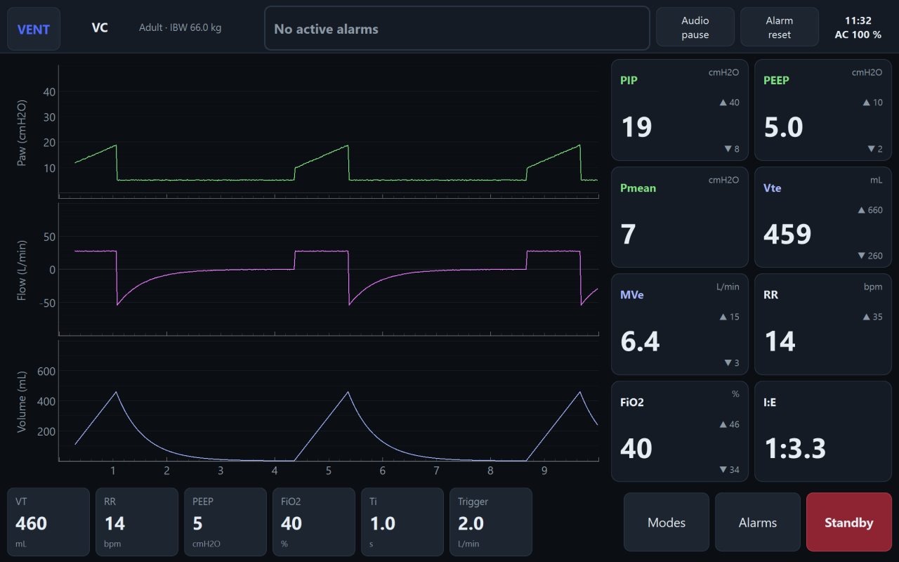

# Ventilator HMI

## 1. What this is

This is the touchscreen interface (Human–Machine Interface, or HMI) for a critical-care
ventilator, built as a graduation project. It is designed to run on a Raspberry Pi 4 and be
shown on a Samsung tablet over VNC, so the operator sees a normal ventilator screen without any
extra hardware. Right now it runs against a **simulated patient**, so the software and the
screen flow can be demonstrated and tested before the real sensor/valve electronics
(the microcontroller, or "MCU") exist.

## 2. What it looks like



The Monitoring screen: live pressure, flow and volume waveforms on the left, measured values
with their alarm limits on the right, current settings and the mode/alarm/standby buttons along
the bottom.

## 3. Run it on your laptop

Requires Python 3.11+. From the project folder:

```bash
python -m venv .venv
.venv\Scripts\pip install -r requirements.txt
.venv\Scripts\python main.py
```

A 1280×800 window opens with the simulated patient running.

## 4. Run it on the Raspberry Pi

```bash
python3 main.py --fullscreen
```

Full step-by-step setup (flashing the SD card, installing Qt, enabling VNC, autostart on boot)
is in **[docs/06-raspberry-pi-setup.md](docs/06-raspberry-pi-setup.md)**.

## 5. Command-line options

| Option | Meaning |
|---|---|
| `--fullscreen` | Fill the screen (use this on the Raspberry Pi; the laptop default is a 1280×800 window) |
| `--serial PORT` | Talk to the real ventilator MCU over this serial port (e.g. `COM3`, `/dev/ttyACM0`) instead of the built-in simulator |
| `--log-dir DIR` | Where to save the event log (default: `~/.ventilator-hmi/logs`) |
| `--no-sound` | Simulator only: do not play the alarm buzzer on the computer speaker |

## 6. Run the tests

```bash
.venv\Scripts\python -m pytest
```

All 150+ tests should pass. They cover the math (IBW, breath analysis, the lung model), the
alarm rules, the serial protocol, and a smoke test that drives the whole app screen by screen.

## 7. Documentation

| Doc | What's in it |
|---|---|
| [docs/01-screen-flow.md](docs/01-screen-flow.md) | The four screens, every button, and why each one works the way it does |
| [docs/02-alarms.md](docs/02-alarms.md) | Every alarm, its priority, colors, sounds, and how the design follows the alarm standards |
| [docs/03-architecture.md](docs/03-architecture.md) | The module map, the data flow, and how to swap the simulator for the real MCU |
| [docs/04-simulator.md](docs/04-simulator.md) | The lung model explained in plain language, and the fault-injection panel |
| [docs/05-serial-protocol.md](docs/05-serial-protocol.md) | The message format for the firmware team building the MCU |
| [docs/06-raspberry-pi-setup.md](docs/06-raspberry-pi-setup.md) | Installing and configuring the Pi, the VNC link, and autostart |
| [docs/07-demo-guide.md](docs/07-demo-guide.md) | A timed script for presenting the demo, including which faults to inject and why |
| [docs/design/2026-09-22-ventilator-hmi-design.md](docs/design/2026-09-22-ventilator-hmi-design.md) | The full design specification (the source of every number in the docs above) |

## 8. Project layout

```
ventilator-hmi/
├─ main.py                      # entry point: --windowed (default on Windows), --fullscreen, --serial PORT
├─ requirements.txt
├─ hmi/
│  ├─ qt.py                     # single place that imports Qt (PySide6 or PyQt5 via pyqtgraph.Qt)
│  ├─ model/                    # plain data + rules — NO Qt imports
│  │   patient.py               #   PatientProfile, IBW formulas, category defaults
│  │   settings.py              #   VentSettings, ParamSpec (range/step/default), cross-checks
│  │   alarm_limits.py          #   AlarmLimits, defaults from category + IBW + settings
│  ├─ core/                     # logic — NO Qt imports (easy to test)
│  │   flow.py                  #   screen-flow state machine
│  │   breath_analyzer.py       #   samples → BreathResult (per breath)
│  │   alarms/
│  │     definitions.py         #   ONE table of all alarm conditions
│  │     engine.py              #   evaluation, delays, latching, audio pause, reset
│  │     event_log.py           #   append-only log (JSON Lines file)
│  ├─ device/
│  │   base.py                  #   DeviceLink (QObject with signals) + data classes
│  │   lung_model.py            #   pure-Python lung physics (no Qt)
│  │   simulator.py             #   SimulatedDevice: timer + lung model + faults + simulated buzzer
│  │   buzzer_sound.py          #   plays IEC pulse patterns on the computer speaker (demo only)
│  │   protocol.py              #   serial message encode/decode + checksum (no Qt)
│  │   serial_device.py         #   SerialDevice skeleton for the real MCU (later)
│  └─ ui/
│      theme.py                 #   colors, fonts, Qt stylesheet
│      main_window.py           #   top bar, step indicator, screen stack, wiring
│      screens/                 #   patient.py, precheck.py, settings.py, monitoring.py
│      widgets/                 #   adjuster, param_tile, numeric_readout, waveform_panel,
│                                #   alarm_banner, step_indicator, toggle_group
│      dialogs/                 #   confirm, adjust_value, keyboard, modes, alarms, demo_panel
├─ tests/                       # pytest
└─ docs/                        # this documentation
```

## 9. Safety note

**This is a graduation-project demo, not a certified medical device.** It is designed following
IEC 60601-1-8 (alarm systems) and ISO 80601-2-12 (critical care ventilators), but it has not been
through the testing, risk management and regulatory approval a real ventilator needs before it can
be used on a patient. It runs on simulated data; the real sensor/valve hardware and its safety
certification are a separate project.
