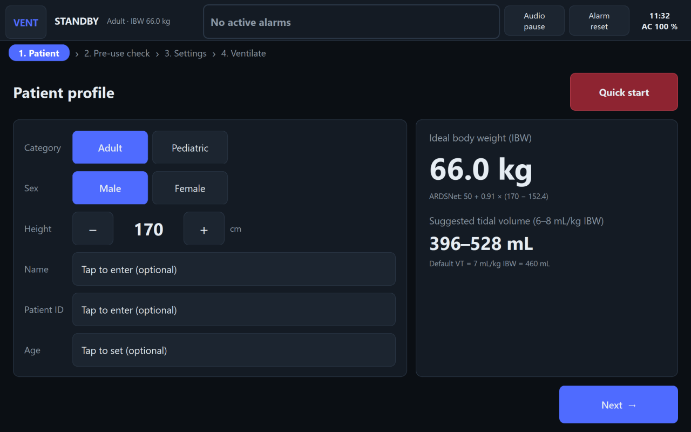
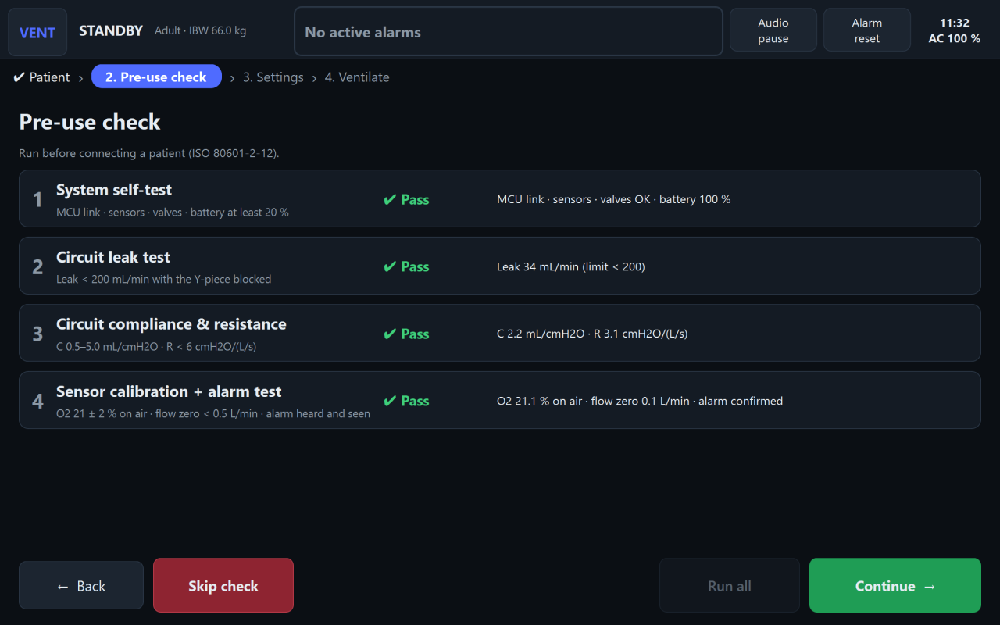
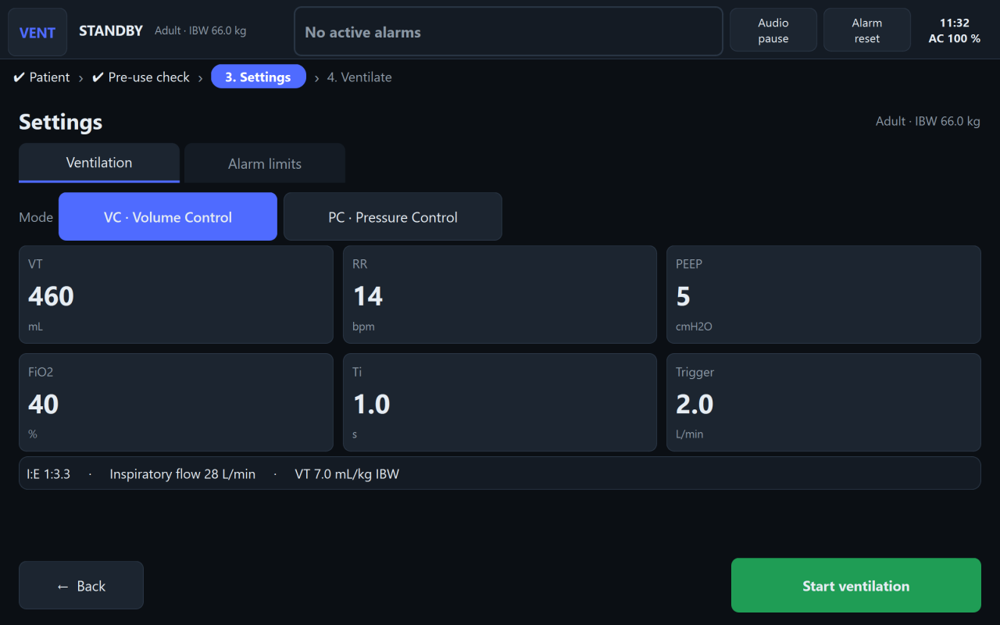
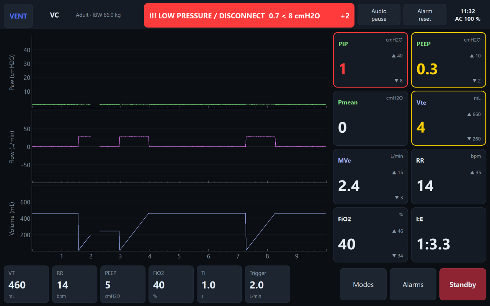

# 01 — Screen Flow

The operator moves through four screens in order. A step indicator at the top always shows where
they are.

```
 ┌─────────────┐   ┌──────────────┐   ┌──────────────┐   ┌──────────────┐
 │ 1. PATIENT  │──▶│ 2. PRE-USE   │──▶│ 3. SETTINGS  │──▶│ 4. MONITORING│
 │   PROFILE   │   │    CHECK     │   │  (initial)   │   │ (ventilating)│
 └─────────────┘   └──────────────┘   └──────────────┘   └──────┬───────┘
   │                                                            │
   │ QUICK START ─▶ "Skip pre-use check?" ─▶ Settings           │ STANDBY (confirm)
   │               (defaults for category)                      ▼
   │                                                   back to 3. SETTINGS
```

- **Back** is allowed from screens 2 and 3, one step at a time.
- From Monitoring, **Standby** (after a confirmation) stops ventilation and returns to Settings.
- **Quick Start** (Patient screen, red button, top-right) skips the pre-use check entirely and
  jumps straight to Settings with default values for the chosen patient category. Because the
  ventilator has not been checked, a low-priority **"Pre-use check not performed"** alarm stays
  on for the rest of the session — see [docs/02-alarms.md](02-alarms.md). The same thing happens
  if the operator taps **Skip** on the Pre-use check screen. The step indicator then shows
  "✖ Pre-use check skipped" in orange, so nobody mistakes it for a completed check.

*Why a fixed order, with only one step of Back?* A ventilator is not a general-purpose app: the
operator should not be able to jump straight to ventilating a patient without first describing the
patient (so the machine can pick safe defaults) and, ideally, testing the circuit. Restricting Back
to one step keeps the screen the operator is looking at always obvious.

---

## Screen 1 — Patient Profile



| Button / field | What happens | Why |
|---|---|---|
| **Category** (Adult / Pediatric) | Switches every range, default and alarm limit on the later screens | Adults and children need very different tidal volumes, pressures and rates; picking the category up front means every later default is already safe for this patient |
| **Sex** (Male / Female) | Used only for the adult IBW formula | Adult IBW formulas differ by sex (see below); pediatric IBW does not use sex |
| **Height** (− / +, cm) | Recomputes IBW live | IBW (not actual body weight) is what lung-protective ventilation is based on |
| **Name / Patient ID** (optional, on-screen keyboard) | Shown in the top bar and in the event log | Lets the team tell sessions apart during a demo; not a patient database |
| **Age** (optional, − / +) | Information only | Not used in any formula in this phase |
| **Next →** | Goes to the Pre-use check screen | Normal path |
| **Quick start** (red) | Confirmation, then straight to Settings with category defaults | Useful when a check was already done earlier the same session, or for a fast demo |

**Ideal Body Weight (IBW)** is shown live, together with the suggested tidal volume range
(6–8 mL/kg IBW, the range used in lung-protective ventilation):

| Category | Formula | Source |
|---|---|---|
| Adult male | IBW = 50 + 0.91 × (height_cm − 152.4) | ARDSNet |
| Adult female | IBW = 45.5 + 0.91 × (height_cm − 152.4) | ARDSNet |
| Pediatric (any sex) | IBW = 2.396 × e^(0.01863 × height_cm) | Traub & Kichen (valid 74–152 cm) |

IBW is rounded to 0.1 kg. The default tidal volume shown on the Settings screen is **7 mL/kg
IBW**, rounded to the nearest 10 mL (adult) or 5 mL (pediatric).

*Why does height set the tidal volume, not weight?* Ventilating by actual body weight over-inflates
overweight patients' lungs — their lung size tracks height, not fat mass. IBW from height is the
standard ARDSNet approach and is what keeps the tidal volume "lung-protective" regardless of the
patient's weight.

Quick Start with no height entered uses a default height (adult male 170 cm, pediatric 110 cm).

---

## Screen 2 — Pre-Use Check



A checklist of four tests, run in order. Each row shows the test name, its status
(pending / running / pass / fail), the measured value, and the pass criterion.

| # | Test | What happens | Pass criterion |
|---|---|---|---|
| 1 | **System self-test** | Checks the MCU link, pressure sensor, flow sensor, O2 sensor, valves and battery | All sub-checks OK, battery ≥ 20 % |
| 2 | **Circuit leak test** | Prompt: *"Block the patient Y-piece, then tap Start."* The machine pressurizes the circuit and measures leak | Leak < 200 mL/min |
| 3 | **Circuit compliance & resistance** | Measures tubing compliance and resistance (Y-piece still blocked) | C 0.5–5.0 mL/cmH2O, R < 6 cmH2O/(L/s) |
| 4 | **Sensor calibration + alarm test** | Calibrates the O2 cell and flow sensor, then sounds the high-priority alarm buzzer and flashes a red bar; the operator taps **"I heard and saw it"** or **"Not heard"** | O2 reads 21 ± 2 % on air, flow zero offset < 0.5 L/min, operator confirms the alarm |

| Button | What happens |
|---|---|
| **Run all** | Runs every test that has not already passed, in order, prompting to block/unblock the Y-piece when needed |
| **Retry** (per failed row) | Re-runs just that test |
| **Continue →** | Enabled only once all four tests have passed; goes to Settings |
| **Skip check** (red) | Confirmation, then goes to Settings with the same "Pre-use check not performed" alarm as Quick Start |
| **← Back** | Returns to the Patient screen |

*Why a pre-use check at all?* ISO 80601-2-12 (the ventilator standard) requires the device to be
checked before it is connected to a patient — leaks, a stuck valve or a miscalibrated O2 sensor
are exactly the kind of fault that must be caught on the bench, not on the patient. The alarm test
also proves the buzzer actually works before it is needed for real. Each test has a short delay
(2–3 s in the demo) so the flow matches what a real self-test looks like; the Demo Panel can force
any one test to fail so the failure/Retry path can be shown (see
[docs/07-demo-guide.md](07-demo-guide.md)).

---

## Screen 3 — Settings (initial)



Two tabs: **Ventilation** and **Alarm limits**.

### Ventilation tab

- **Mode** selector: **VC** (Volume Control) or **PC** (Pressure Control).
- A grid of large parameter tiles; tapping one opens an adjuster (− / + and Confirm/Cancel).
- The **VT tile is pre-filled from IBW** (7 mL/kg, rounded).
- A tile shows an **orange border and note** when its value is outside the typical/lung-protective
  range (e.g. VT outside 6–8 mL/kg IBW). This is an *advisory*, not an alarm — orange is used
  because red, yellow and cyan are reserved for alarms only, so an advisory is never confused with
  a real alarm condition.
- Read-only computed info: **I:E ratio**, and in VC mode the **inspiratory flow** (VT / Ti).

**Parameter ranges and defaults**

| Parameter | Mode | Adult range (default) | Pediatric range (default) | Step |
|---|---|---|---|---|
| VT — tidal volume (mL) | VC | 200–1000 (7 mL/kg IBW) | 50–500 (7 mL/kg IBW) | 10 / 5 |
| Pinsp — pressure above PEEP (cmH2O) | PC | 5–40 (15) | 5–35 (12) | 1 |
| RR — rate (breaths/min) | both | 5–40 (14) | 10–60 (20) | 1 |
| PEEP (cmH2O) | both | 0–20 (5) | 0–15 (5) | 1 |
| FiO2 (%) | both | 21–100 (40) | 21–100 (40) | 1 |
| Ti — inspiratory time (s) | both | 0.5–2.5 (1.0) | 0.3–1.5 (0.7) | 0.1 |
| Trigger — flow trigger (L/min) | both | 1–10 (2) | 0.5–5 (1) | 0.5 |

**Cross-checks.** The **Confirm** button in the adjuster (or **Start ventilation**) is disabled and
shows why, whenever a combination of settings would be unsafe:

| Cross-check | Rule | Why |
|---|---|---|
| No inverse I:E | Ti ≤ 0.5 × (60 / RR) | Inspiration must not last longer than expiration — an "inverse" I:E traps air and is used deliberately only in specialist modes this HMI does not support |
| VC flow limit | VT/Ti ≤ 120 L/min (adult) / 60 L/min (pediatric) | A flow above this is not physiologically deliverable through a normal circuit and usually means a typo |
| PC pressure headroom | PEEP + Pinsp ≤ Ppeak high alarm limit − 2 cmH2O | Leaves at least 2 cmH2O of margin before the high-pressure alarm/safety cut-off fires on every normal breath |

### Alarm limits tab

Pre-filled from the patient's category and IBW (see [docs/02-alarms.md](02-alarms.md) for the
default table); each limit is editable with the same adjuster, with a **Restore defaults** button.
Every change — to a setting or a limit — is written to the event log, so there is a record of who
changed what and when.

**Start ventilation** (large green button) asks for confirmation, then starts the device and moves
to the Monitoring screen.

---

## Screen 4 — Monitoring


- **Waveforms** (left): pressure, flow and volume, three stacked plots, 10 s sweep window (like a
  bedside monitor — left to right with an erase gap, not a scrolling strip). Fixed Y-axis ranges
  per patient category, so the trace never jumps around and stays easy to read at a glance.
- **Numeric readouts** (right): PIP, PEEP, Pmean, Vte, MVe, RR, FiO2, I:E, updated every breath.
  Each shows its own alarm limits in small print; a value in violation takes the alarm color
  (see the alarm example below).
- **Bottom bar**: the current settings as tiles — tap one to open the adjuster; Confirm applies it
  to the device immediately and logs the change. In PC mode the VT tile is replaced by Pinsp.
- **Modes**: switches VC ↔ PC with confirmation. To keep ventilation similar across the switch,
  VC→PC sets Pinsp = last PIP − PEEP, and PC→VC sets VT = last Vte (clamped to the normal range).
- **Alarms**: opens a dialog with three tabs — *Active alarms*, *Limits* (same editor as the
  Settings tab), and *Log* (the most recent 500 event-log entries).
- **Audio Pause** (🔕, top bar) and **Alarm Reset** (↺, top bar) — see
  [docs/02-alarms.md](02-alarms.md) for exactly what each does.
- **Standby**: confirmation, then stops ventilation and returns to Settings.

### Example: an active alarm



Here a disconnected circuit has been simulated (via the Demo Panel). The banner shows the
highest-priority active alarm in red with its `!!!` priority marker and a "+2" badge for the other
active alarms, and each readout whose value is driving an alarm changes to that alarm's color
(red for the high-priority LOW PRESSURE, yellow for the medium-priority alarms on PEEP and Vte).
